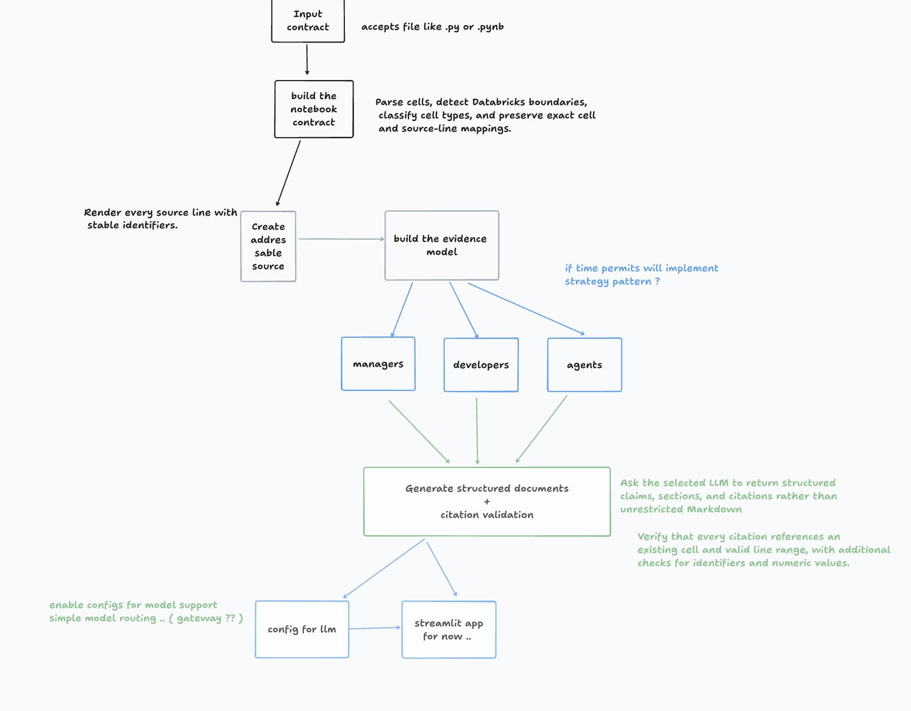

# Notebook Explainer

Point it at a notebook on disk and it writes three documents (for a manager, a developer, and an AI agent).
Every claim cites the cell and lines it comes from. Click a cite to see that code.


## Ideation



* Define the input contract
  Accept a local Databricks .py or Jupyter .ipynb file without executing it, keeping analysis fully source-based.

* Build the notebook parser
  Parse cells, detect Databricks boundaries, classify cell types, and preserve exact cell and source-line mappings.

* Create addressable source
  Render every source line with stable identifiers such as C4 L33, allowing the model to reference precise code locations.

* Build the evidence model
  Represent claims, citations, cells, and line ranges as structured objects so every factual statement can be traced back.

* Design audience-specific prompts
  Create separate instructions for managers, developers, and AI coding agents, each focusing on their specific information needs.

* Generate structured documents
  Ask the selected LLM to return structured claims, sections, and citations rather than unrestricted Markdown.

* Implement citation validation
  Verify that every citation references an existing cell and valid line range, with additional checks for identifiers and numeric values.
## Run (one command)

```bash
./run3.sh            # creates .venv, installs app/requirements.txt, opens http://localhost:8501
```

## Switch provider

Edit `model` in `app3/config.yaml`, or override it for one run:

```bash
HARNESS_MODEL=google:gemini-2.5-flash     GOOGLE_API_KEY=... ./run3.sh
HARNESS_MODEL=openai:gpt-4o-mini OPENAI_API_KEY=... ./run3.sh
```

For Gemini or OpenAI, set `output_mode: tool`. For Ollama, keep `native`.

## Flow

```
notebook file ─► ① notebook.py  parse into numbered cells          (plain Python, no LLM)
              ─► ② harness.py   Pydantic AI agent → Doc{sections[claims[cites]]}
              ─► ③ harness.py   check() each cite against the parsed cells
                                 └─ fails → ModelRetry with the reasons (up to `retries` times)
                                 └─ still fails → claim is dropped and listed in the UI
              ─► ④ app.py       tabs per document; each cite is a popover showing the code
```

| File | Job |
|---|---|
| `notebook.py` | parse `.py` (Databricks source) / `.ipynb` → `Cell(id, kind, lines)` |
| `harness.py` |  prompts, Pydantic models, citation checker, agent |
| `app.py` | Streamlit UI |


## How parsing works (`notebook.py`)

**Databricks `.py` source** (the export format of `cash_application_engine.py`):

1. Read the file and number every line from 1, so line numbers match the file in your editor.
2. Skip line 1 if it is `# Databricks notebook source`.
3. Split on lines that equal `# COMMAND ----------`. Each block is one cell. Cells are numbered `C1`, `C2`, … in order.
4. Trim blank lines at the start and end of each cell, so a cell's range (`L48-L53`) covers only real code.
5. Classify each cell from its non-blank lines, after removing the `# MAGIC ` prefix:
   - first token `%md` / `%sql` / `%run` / `%sh` / `%pip` → `markdown` / `sql` / `run` / …
   - every line starts with `#` → `commented` (dead code that never runs, e.g. the old v2 matching in C15 and fuzzy matching in C20)
   - anything else → `python`

**Jupyter `.ipynb`**: each JSON cell becomes one cell. `cell_type: markdown` → `markdown`, and code cells are classified the same way as above. Lines are numbered continuously across cells, so every line number is unique.

For the sample notebook this gives **47 cells**. Expand "① Parsed cells" in the UI to see the split.

**What the LLM sees.** Every line is prefixed with its own address:

```
=== C4 [python] ===
C4 L33 | TOL = 0.5
C4 L34 | MAX_WO = 250.0
...
=== C20 [commented] ===
C20 L209 | # import difflib
```

The model copies `{cell, start, end}` from these prefixes.

## How citations are enforced (`harness.check`)

Each claim is checked against the parsed source. It is kept only if all of these hold:

| Check | Catches |
|---|---|
| cell exists and `start..end` falls inside it | made-up or out-of-range cites |
| wrong cell id but lines unique to another cell → **auto-repaired** | off-by-one cell numbers (line numbers are globally unique) |
| range ≤ 20 lines | "cite the whole cell" padding |
| every `` `identifier` `` in the claim appears in the cited lines | claims about code the cite doesn't show |
| every number in the claim appears in the cited lines | wrong thresholds (e.g. saying `TOL` is 0.5 while citing L361 `TOL = 5.0`) |
| if all cited lines are comments, the claim must say so (commented / disabled / parked …) | describing dead code as live |
